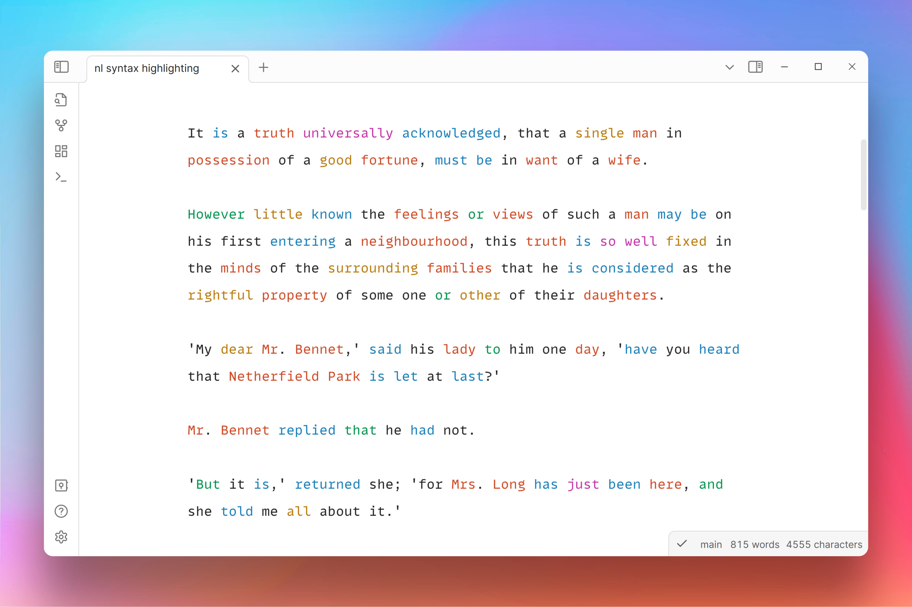
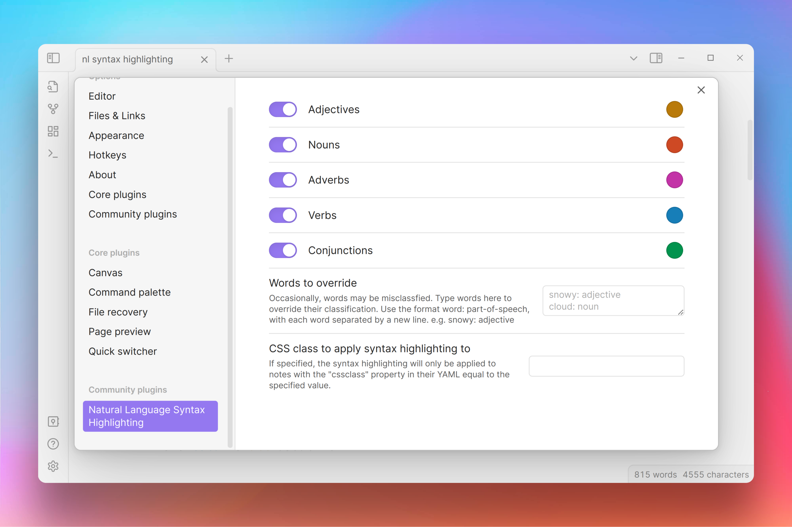

# Natural Language Syntax Highlighting

A plugin for [Obsidian.md](https://obsidian.md/) that highlights adjectives, nouns, adverbs, verbs, and conjunctions in the editor. Inspired by iA Writer.

Colours can be customised in the plugin settings.

## Contributing

Any contributions and PRs are welcome.

## Acknowledgements

This plugin uses the [compromise](https://github.com/spencermountain/compromise) natural language processing library to detect parts of speech.
